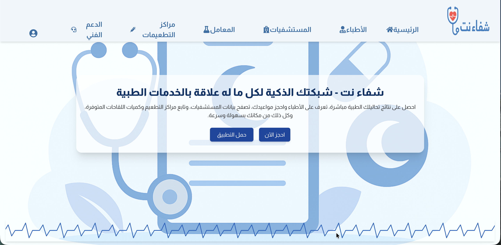
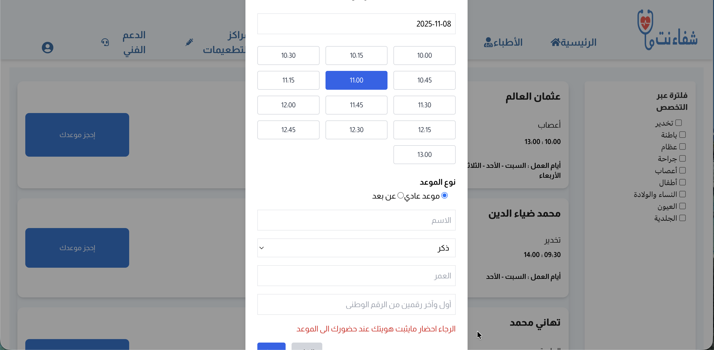
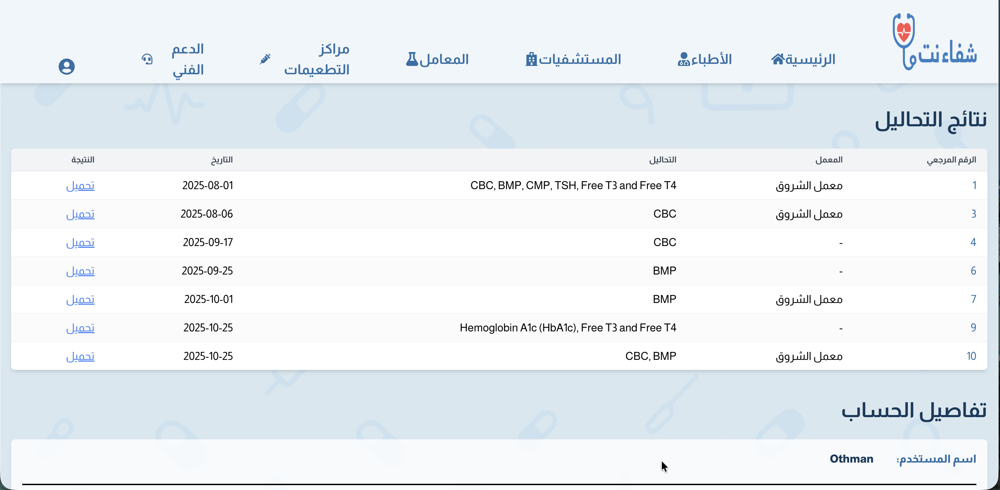
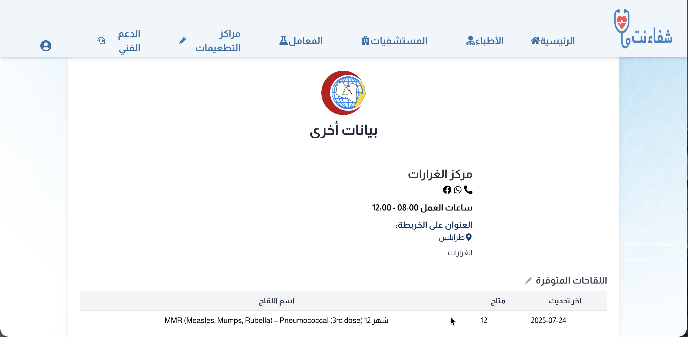

# شفاء نت — Shifaa Net | Frontend

> **A digital healthcare access platform for Libya**  
> Graduation Project · Alhadira University · Grade: 90%

---

## Overview

This is the React frontend for Shifaa Net — a digital health platform designed to connect Libyan patients with hospitals, laboratories, and vaccination centres through a single unified interface.

For the full project description, features, and context see the backend repo:  
👉 [shifaanet-backend](https://github.com/Othman0o3/shifaanet-backend)

---

## Screenshots

### Home Page


### Hospital Booking


### Lab Results


### Vaccination Centre Locator


---

## Tech Stack

| Layer | Technology |
|-------|-----------|
| Framework | React |
| State Management | Context API |
| Styling | Tailwind CSS |
| HTTP Client | Axios |
| Routing | React Router |
| Build Tool | Create React App |

---

## Features

- 🏥 Browse and book hospital appointments
- 💻 Join online video consultations
- 🧪 View and download lab test results
- 💉 Search vaccination centres by vaccine availability
- 🔐 Patient authentication and account management

---

## Running Locally

### Prerequisites
- Node.js 16+
- yarn or npm
- Backend server running at `http://localhost:9000`

### Setup

```bash
# Clone the repo
git clone https://github.com/Othman0o3/shifaanet-frontend.git
cd shifaanet-frontend

# Install dependencies
yarn install
# or
npm install

# Start the development server
yarn start
# or
npm start
```

The frontend will be available at `http://localhost:3000`

> Make sure the backend is running at `http://localhost:9000` before starting the frontend.

---

## Project Structure

```
src/
├── api/
│   └── axiosInstance.js     # Axios config with base URL and interceptors
├── assets/                  # Images and static assets
├── components/              # Reusable UI components
│   ├── Header.jsx
│   ├── Hero.jsx
│   ├── BookingModal.jsx
│   ├── Dcards.jsx
│   ├── HLVcards.jsx
│   └── Filter.jsx
├── pages/                   # Page-level components
│   ├── Main.jsx             # Landing page
│   ├── Hospitals.jsx        # Hospital listing
│   ├── DoctorsPage.jsx      # Doctor listing
│   ├── LabsPage.jsx         # Laboratory listing
│   ├── VaccCentersPage.jsx  # Vaccination centre locator
│   ├── DetailPage.jsx       # Entity detail view
│   ├── RoomPage.jsx         # Video consultation room
│   ├── LoginPage.jsx
│   ├── SignupPage.jsx
│   └── MyAccountPage.jsx
└── utils/
    └── api.js               # API helper functions
```

---

## Academic Context

This frontend was built as part of the Shifaa Net graduation project at Alhadira University, Tripoli, Libya (Fall 2025). The project was awarded a grade of **90%**.

> **Note:** This is currently an academic proposal project, not yet deployed in production.

---

## Developer

**Othman Elalem** — Full Stack Software Engineer, Tripoli, Libya  
[github.com/Othman0o3](https://github.com/Othman0o3)
